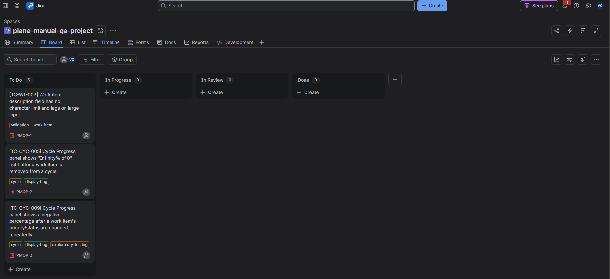

# Defect summary, Plane QA project

All defects are logged and tracked in Jira (project: **Plane QA - Defect Tracking**).

## How defects were triaged

Each failed test case is logged as a Jira bug with steps to reproduce, expected vs.
actual result, environment, and screenshot evidence. The Jira issue key goes back
into the **Defect ID** column of `Test_Cases.xlsx` and `RTM.xlsx`. At least 2 to 3
defects get walked through the full lifecycle (New, triaged, Fixed/Rejected/Deferred,
Retest, Closed) to show defect management end to end, not just filing. Since Plane is
a live third-party product outside this project's control, most tickets will
realistically sit in a "reported, no fix control" state, which is noted honestly per
defect below instead of marked as fixed when it wasn't.

## Defect log

| Defect ID (Jira) | Test Case ID | Module | Title | Severity | Priority | Status | Notes |
|---|---|---|---|---|---|---|---|
| [PMQP-1](https://vinaysd.atlassian.net/browse/PMQP-1) | TC-WI-003 | Work Item | Description field has no visible character limit and shows input lag past ~500 characters | Low | P3 | New | The field still saves correctly, so the test case itself is scored Pass. This is a validation/UX and minor performance observation, not a functional failure, but it reproduces reliably, so it's filed as a real ticket. |
| [PMQP-2](https://vinaysd.atlassian.net/browse/PMQP-2) | TC-CYC-005 | Cycle | Cycle Progress panel shows "Infinity% of 0" for Started right after a work item is removed from a cycle | Low | P3 | New | Precise repro: add a work item to a cycle, then remove it. Before refreshing, Started shows "Infinity% of 0" while every other row correctly shows "0% of 0". Refreshing the page fixes it, so this is a stale client-side calculation, not a persisted data problem. (Corrected from an earlier, vaguer repro.) |
| [PMQP-3](https://vinaysd.atlassian.net/browse/PMQP-3) | TC-CYC-009 | Cycle | Cycle Progress panel shows a negative percentage ("-100% of 1") after a work item's priority/status are changed repeatedly | Low | P2 | New | Found during exploratory testing, not the original scripted suite. Repro: add 1 work item to a cycle, cycle its priority through several values, then its status through several values. The Progress panel then shows "Backlog: -100% of 1" at the same time as "Started: 100% of 1", so the per-state counts clearly aren't being reconciled correctly as the item moves between states. Kept as a permanent regression case (TC-CYC-009). |

**Overall result:** 47 test cases attempted (46 originally scripted, 1 added from
exploratory testing): 44 Pass, 3 Fail. All 3 failures are Low-severity
display/reporting issues: no data loss, no core functionality broken, and two of
the three fix themselves on a page refresh. Every case in the suite has a final,
confirmed outcome (see `Regression_Summary.md` for the resolution history on the
few that needed a second look). No critical, high, or medium-severity defects
turned up.
See the Test Summary Report for the release recommendation this supports.

## Board snapshot

## Defect distribution

| Module | Defects Found | Critical | High | Medium | Low |
|---|---|---|---|---|---|
| Workspace / Members | 0 | 0 | 0 | 0 | 0 |
| Project | 0 | 0 | 0 | 0 | 0 |
| Work Item | 1 | 0 | 0 | 0 | 1 |
| Cycle | 2 | 0 | 0 | 0 | 2 |
| End-to-End | 0 | 0 | 0 | 0 | 0 |
| **Total** | **3** | **0** | **0** | **0** | **3** |